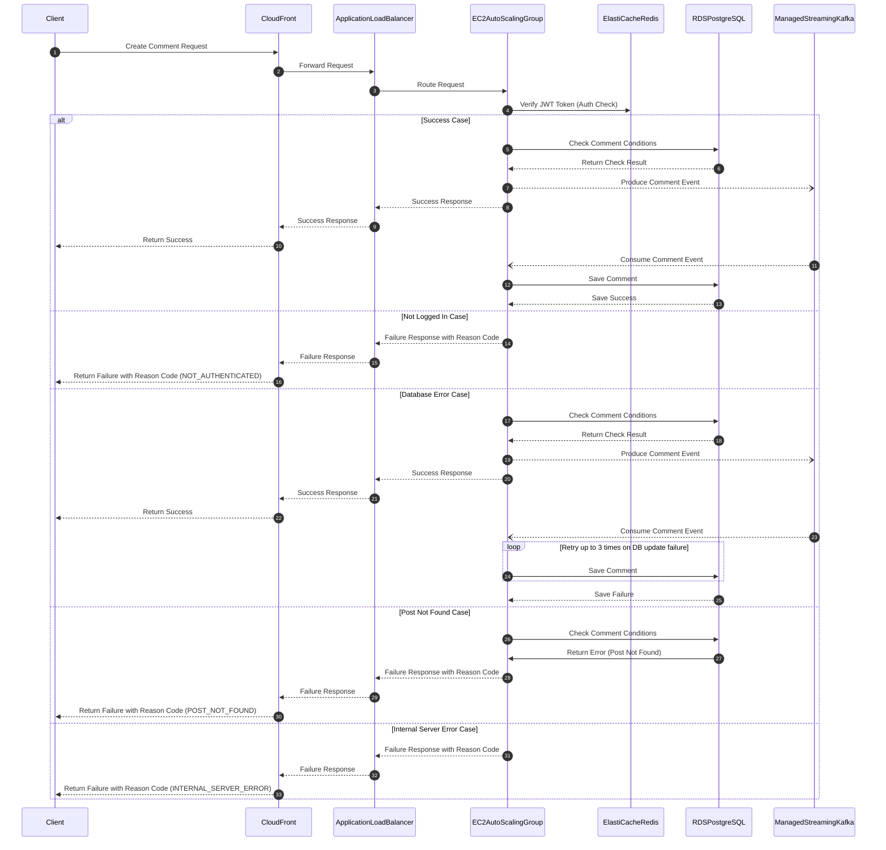

```mermaid
sequenceDiagram
    autonumber
    participant Client
    participant CloudFront
    participant ApplicationLoadBalancer
    participant EC2AutoScalingGroup
    participant ElastiCacheRedis
    participant RDSPostgreSQL
    participant ManagedStreamingKafka

    Client ->> CloudFront: Create Comment Request
    CloudFront ->> ApplicationLoadBalancer: Forward Request
    ApplicationLoadBalancer ->> EC2AutoScalingGroup: Route Request
    
    EC2AutoScalingGroup ->> ElastiCacheRedis: Verify JWT Token (Auth Check)
    
    alt Success Case
        EC2AutoScalingGroup ->> RDSPostgreSQL: Check Comment Conditions
        RDSPostgreSQL -->> EC2AutoScalingGroup: Return Check Result
        EC2AutoScalingGroup --) ManagedStreamingKafka: Produce Comment Event
        EC2AutoScalingGroup -->> ApplicationLoadBalancer: Success Response
        ApplicationLoadBalancer -->> CloudFront: Success Response
        CloudFront -->> Client: Return Success
        
        ManagedStreamingKafka --) EC2AutoScalingGroup: Consume Comment Event
        EC2AutoScalingGroup ->> RDSPostgreSQL: Save Comment
        RDSPostgreSQL -->> EC2AutoScalingGroup: Save Success
    
    else Not Logged In Case
        EC2AutoScalingGroup -->> ApplicationLoadBalancer: Failure Response with Reason Code
        ApplicationLoadBalancer -->> CloudFront: Failure Response
        CloudFront -->> Client: Return Failure with Reason Code (NOT_AUTHENTICATED)
    
    else Database Error Case
        EC2AutoScalingGroup ->> RDSPostgreSQL: Check Comment Conditions
        RDSPostgreSQL -->> EC2AutoScalingGroup: Return Check Result
        EC2AutoScalingGroup --) ManagedStreamingKafka: Produce Comment Event
        EC2AutoScalingGroup -->> ApplicationLoadBalancer: Success Response
        ApplicationLoadBalancer -->> CloudFront: Success Response
        CloudFront -->> Client: Return Success
        
        ManagedStreamingKafka --) EC2AutoScalingGroup: Consume Comment Event
        loop Retry up to 3 times on DB update failure
            EC2AutoScalingGroup ->> RDSPostgreSQL: Save Comment
        end
        RDSPostgreSQL -->> EC2AutoScalingGroup: Save Failure
    
    else Post Not Found Case
        EC2AutoScalingGroup ->> RDSPostgreSQL: Check Comment Conditions
        RDSPostgreSQL ->> EC2AutoScalingGroup: Return Error (Post Not Found)
        EC2AutoScalingGroup -->> ApplicationLoadBalancer: Failure Response with Reason Code
        ApplicationLoadBalancer -->> CloudFront: Failure Response
        CloudFront -->> Client: Return Failure with Reason Code (POST_NOT_FOUND)
    
    else Internal Server Error Case
        EC2AutoScalingGroup -->> ApplicationLoadBalancer: Failure Response with Reason Code
        ApplicationLoadBalancer -->> CloudFront: Failure Response
        CloudFront -->> Client: Return Failure with Reason Code (INTERNAL_SERVER_ERROR)
    end

```
